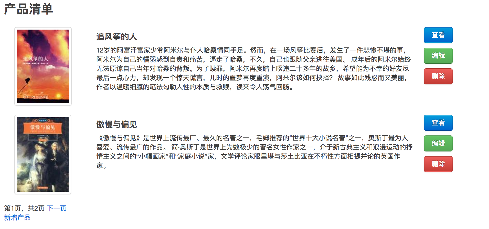

*********************************
关于界面：改造 ProductList 界面
*********************************

有了上一节关于 Django 模板的基础，改造界面就很容易理解了。将界面设计师设计的页面中的内容根据复用程度分别放到基础模板 `base.html` 和专用模板 `productlist.html` 中。

::

    # depot/templates/base.html

    <html xmlns="http://www.w3.org/1999/xhtml">
    <head>
      <meta http-equiv="Content-Type" content="text/html; charset=utf-8">
      <meta name="description" content="a depot implement with Django"/>
      <meta name="keywords" content="django,depot" />
      <meta name="author" content="Holbrook(http://hi.csdn.net/space-2668.html)" />
      <title> 标题 </title>
      <link rel="stylesheet" href="/static/css/bootstrap.min.css">
    </head>
    <body>
      

        
        内容
        
      

    </body>
    </html>

base作为整个网站的基础布局，包含了所有页面都需要的bootstrap.min.css。同时设置了两个内容块（title, content)。在productlist.html中替换这两个内容块：

::

    # depot/templates/depotapp/list_product.html

    

     产品清单 

    

    

      

      <h2>产品清单</h2>
      

      
      

        

          
        

        

          <h4>{{item.title}}</h4>
          {{item.description}}
        

        

          
<a class="btn primary" href="">查看</a></a> 

          
<a class="btn success" href="">编辑</a> 

          
<a class="btn danger" href="#">删除</a>

          

      

      

      
        <a href="?page={{ list_items.previous_page_number }}">上一页</a>
      
      
        第{{ list_items.number }}页，共{{ list_items.paginator.num_pages }}页
      
      
        <a href="?page={{ list_items.next_page_number }}">下一页</a>
      

      
<a href="">新增产品</a>

    

先是声明这个模板继承自 `base.html`，然后是两个内容块的实现。

注意其中链接的写法：`href=""`。这样定义的 href 是关联到 view 函数，而不是硬编码的 URL。在以后如果改变了 URLconf 的定义，不需要再更改模板。**这个功能不是 Rails 特有的！**

关于分页的部分，无需关注，以后再说。

最后，认真填写一下表单，将真正的数据存到数据库，就可以在 http://localhost:8000/depotapp/product/list/ 看到漂亮的界面了。

例子中使用的书籍信息和图片链接均来自豆瓣读书。
