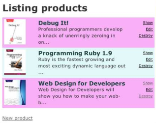
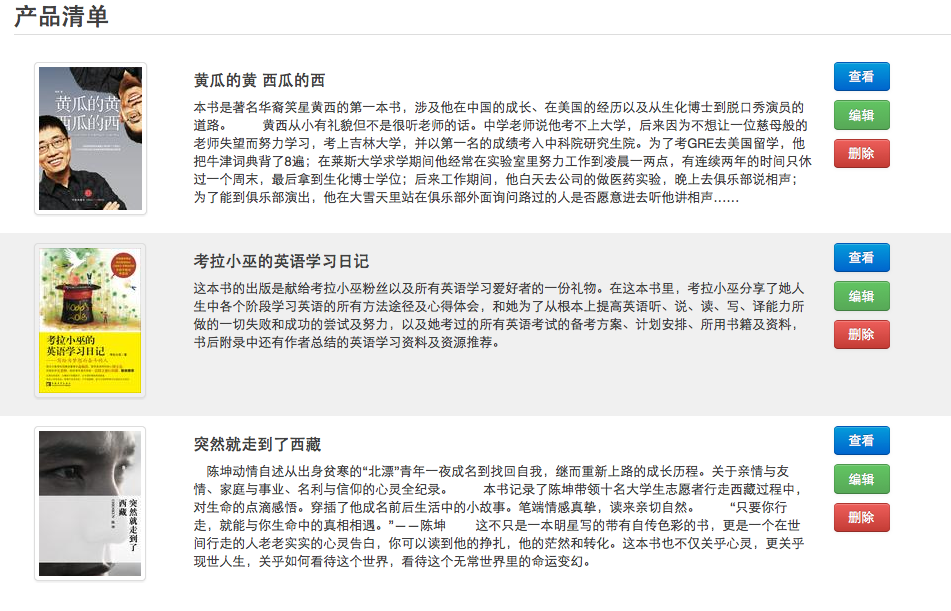

*************************************
关于界面：引入Bootstrap，设置静态资源
*************************************

之前生成了 Product 类的 scaffold，但是如同 Rails 的开发者 David 所讲的那样，scaffold 几乎没什么用。所以按照《Agile Web Development with Rails 4th》中的迭代计划，下一步的修改是美化 list 页面：

但是这个界面还是太丑陋了。其实，有了 Bootstrap 后，很多站点都变成了“又黑又硬”的工具条 + “小清新”风格。我们即不能免俗，又懒得自已设计风格，不妨用 Bootstrap 将产品清单界面重新设计成如下的风格：

下面让我们来实现这个界面。显然 Web 界面会使用一些静态资源（css，js，image等），要在 Django 中引入静态资源。Django 在正式部署的时候对于静态资源有特殊的处理，在开发阶段，可以有简单的方式让静态资源起作用。

首先在 Depot 目录下面创建一个 static 目录，并将静态资源按合理的组织方式放入其中::

    static/
      css/
        bootstrap.min.css
      js/
      images/
      productlist.html

其中 `productlist.html` 是请界面设计师实现的产品清单静态页面；`css/bootstrap.min.css` 是该页面使用的样式表，来自 Bootstrap，将来整个系统都将使用这一套样式风格；`js` 目录现在为空，以后可以将 JavaScript 代码放在这里；`images` 文件夹同理。

我们可以看到，Django 对于静态内容的管理非常符合管理。相比之下，Rails 要求你将静态内容放到很怪异的结构中::

    app/
      assets/
      images/
      javascripts/
      stylesheets/

界面设计师实现的界面要想运行起来，还需要修改相关的路径，或者改变自己的目录设置习惯。这种设计让人难以理解。

回到 Django，让静态资源起作用只需要简单的配置（下面的做法只适用于开发阶段）：

修改 `depot/settings.py` 的 `static files` 小节::

    import os
    ... ...

    # Additional locations of static files
    HERE = os.path.dirname(__file__)
    STATICFILES_DIRS = (
        # Put strings here, like "/home/html/static" or "C:/www/django/static".
        # Always use forward slashes, even on Windows.
        # Don't forget to use absolute paths, not relative paths.
        HERE + STATIC_URL,
    )

然后在 `depot/urls.py` 中增加 static 的 url 映射::

    from django.contrib.staticfiles.urls import staticfiles_urlpatterns
    ... ...

    # for development only
    # This will only work if DEBUG is True.
    urlpatterns += staticfiles_urlpatterns()

启动 server，就可以通过 http://127.0.0.1:8000/static/productlist.html 看到设计好的界面了。

在下一节，终于可以修改模板，美化产品清单页的样式了。
